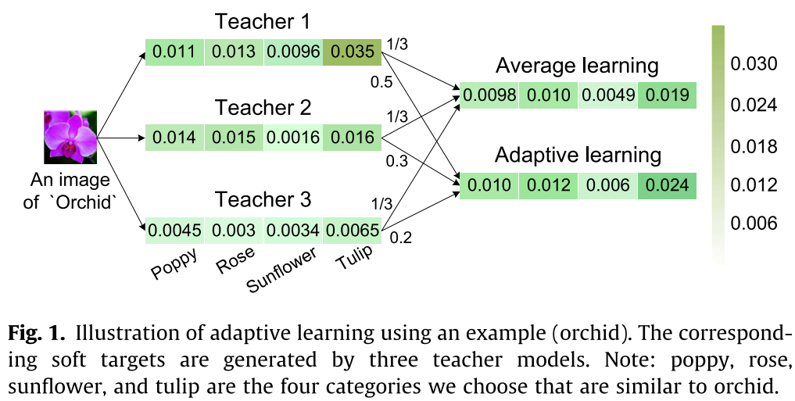
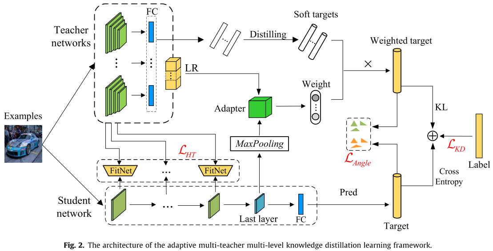
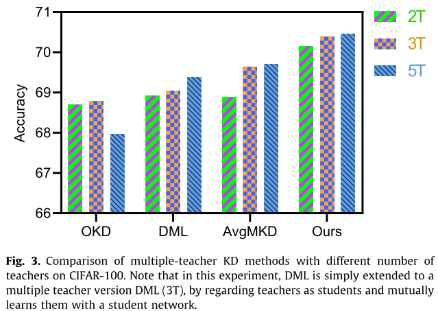
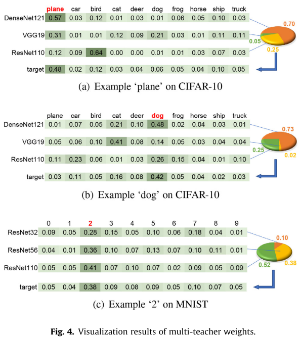

# Adaptive Multi-Teacher Multi-level Knowledge Distillation(AMTML-KD)

Paper accepted by Neurocomputing 415(2020): 106–113.

By [Yuang Liu](https://flhonker.github.io/), Wei Zhang and Jun Wang.

## Requirements

* PyTorch >= 1.0.0 
* Jupyter
* visdom

## Introduction

Knowledge distillation (KD) is an effective learning paradigm for improving the performance of light-weight student networks by utilizing additional supervision knowledge distilled from teacher networks. Most pioneering studies either learn from only a single teacher in their distillation learning methods, neglecting the potential that a student can learn from multiple teachers simultaneously, or simply treat each teacher to be equally important, unable to reveal the different importance of teachers for specific examples. To bridge this gap, we propose a novel adaptive multi-teacher multi-level knowledge distillation learning framework (**AMTML-KD**), which consists two novel insights: (i) associating each teacher with a latent representation to adaptively learn instance-level teacher importance weights which are leveraged for acquiring integrated soft-targets (high-level knowledge) and (ii) enabling the intermediate-level hints (intermediate-level knowledge) to be gathered from multiple teachers by the proposed multi-group hint strategy. As such, a student model can learn multi-level knowledge from multiple teachers through AMTML-KD. Extensive results on publicly available datasets demonstrate the proposed learning framework ensures student to achieve improved performance than strong competitors.









## Citation

```
@article{LIU2020,
title = "Adaptive Multi-Teacher Multi-level Knowledge Distillation",
journal = "Neurocomputing",
year = "2020",
issn = "0925-2312",
doi = "https://doi.org/10.1016/j.neucom.2020.07.048",
url = "http://www.sciencedirect.com/science/article/pii/S0925231220311565",
author = "Yuang Liu and Wei Zhang and Jun Wang",
keywords = "Knowledge distillation, Adaptive learning, Multi-teacher",
abstract = "Knowledge distillation (KD) is an effective learning paradigm for improving the performance of lightweight student networks by utilizing additional supervision knowledge distilled from teacher networks. Most pioneering studies either learn from only a single teacher in their distillation learning methods, neglecting the potential that a student can learn from multiple teachers simultaneously, or simply treat each teacher to be equally important, unable to reveal the different importance of teachers for specific examples. To bridge this gap, we propose a novel adaptive multi-teacher multi-level knowledge distillation learning framework (AMTML-KD), which consists two novel insights: (i) associating each teacher with a latent representation to adaptively learn instance-level teacher importance weights which are leveraged for acquiring integrated soft-targets (high-level knowledge) and (ii) enabling the intermediate-level hints (intermediate-level knowledge) to be gathered from multiple teachers by the proposed multi-group hint strategy. As such, a student model can learn multi-level knowledge from multiple teachers through AMTML-KD. Extensive results on publicly available datasets demonstrate the proposed learning framework ensures student to achieve improved performance than strong competitors."
}
```
